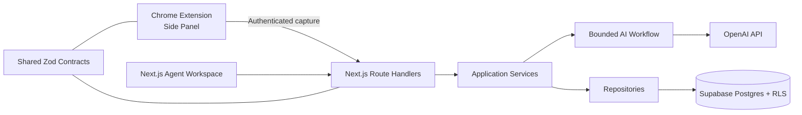

# AI Web Scout

AI Web Scout is a privacy-conscious agent workspace that turns the page currently open in Chrome into structured, actionable insight. The Chrome extension is a small sensor; the Next.js application and bounded AI workflow are the product core.

> Phase 5 complete: foundation, Supabase persistence, Agent Workspace, Chrome sensor, and the bounded OpenAI agent workflow are implemented.

## What it solves

Web pages such as job listings, technical articles, repositories, and product pages contain different signals. AI Web Scout captures only user-reviewed plain text, classifies the page, runs a page-specific analysis, and preserves both the result and safe operational steps without exposing model chain-of-thought.

## MVP features

- Capture title, URL, visible body text, selected text, meta description, and timestamp from Chrome.
- Preview and approve captured content in a Manifest V3 Side Panel.
- Analyze jobs, articles, GitHub pages, companies/services, and general pages.
- Show history, status, recommendations, evidence, and a node-based Agent Workspace.
- Store user-owned data in Supabase with RLS.
- Generate and validate structured AI output on the server.

## Architecture



See [docs/architecture.md](docs/architecture.md) for the complete design, data model, APIs, risks, assumptions, and phased plan.

## Technology

- pnpm workspace + TypeScript project references
- Next.js App Router, React, Tailwind CSS, TanStack Query, React Hook Form, Zod
- Motion and Lucide React for meaningful status transitions and icons
- Chrome Extension Manifest V3, Side Panel API, Vite
- Supabase Auth/Postgres/RLS and OpenAI Structured Outputs (phases 2 and 5)
- Vitest for contracts and application logic

The extension uses plain Vite rather than a framework to keep permissions, runtime boundaries, and generated output easy to audit.

## Directory layout

```text
apps/web/                 Next.js application
apps/extension/           Manifest V3 Side Panel extension
packages/shared/          Shared types, schemas, and constants
packages/eslint-config/   Shared ESLint configuration
supabase/migrations/      Database migrations (phase 2)
docs/                     Architecture and decisions
```

## Setup

Requirements: Node.js 22+, pnpm 11+, a Supabase project, and an OpenAI API key.

```bash
pnpm install
cp .env.example .env.local
pnpm dev
```

Web: `http://localhost:3000`. Build the extension with `pnpm --filter @ai-web-scout/extension build`, open `chrome://extensions`, enable Developer mode, choose **Load unpacked**, and select `apps/extension/dist`.

The Side Panel can capture, validate, preview, and submit the current page. Follow [docs/phase-4-chrome-extension.md](docs/phase-4-chrome-extension.md) for permissions, environment setup, Chrome loading, and manual checks. The bounded agent design is documented in [docs/phase-5-ai-agent.md](docs/phase-5-ai-agent.md); public API integration follows in phase 6.

## Environment

Copy `.env.example` to `.env.local`. Never place `OPENAI_API_KEY` or `SUPABASE_SERVICE_ROLE_KEY` in a `NEXT_PUBLIC_*` variable or extension bundle.

## Commands

```bash
pnpm dev          # run workspace development servers
pnpm build        # build all packages and apps
pnpm lint         # lint all workspaces
pnpm typecheck    # TypeScript validation
pnpm test         # Vitest suite
pnpm format       # format source files
```

## Supabase and OpenAI

Phase 2 provides migrations, typed clients, repository adapters, and owner-only RLS policies. Follow [docs/supabase-setup.md](docs/supabase-setup.md) to create a project, apply the migration, configure keys, and verify policies. See [docs/persistence.md](docs/persistence.md) for the data-access architecture. Phase 5 adds server-only OpenAI Responses API integration with Structured Outputs and bounded Tool Calling.

## Agent design

Unlike a single-prompt LLM wrapper, the workflow validates input, normalizes content, classifies the page, selects a bounded strategy, optionally loads the profile, validates structured output, and records safe step summaries. Tool count, workflow steps, input size, and token budgets are bounded. Raw reasoning and chain-of-thought are never stored.

## Security

- Capture only plain, visible text; exclude form controls and editable regions.
- Require an explicit preview before sending and enforce a text limit.
- Keep privileged keys server-side and authenticate every API call.
- Validate URLs and payloads with shared Zod contracts.
- Use user-scoped queries plus Supabase RLS as defense in depth.

## Out of scope for MVP

Autonomous browsing, application submission, external search, GitHub/Gmail APIs, RAG, vector search, multi-agent workflows, payments, teams, and non-Chrome browsers.

## Roadmap

1. Foundation and contracts
2. Supabase persistence and RLS
3. Mock-first product UI and Agent Workspace
4. Chrome capture and authenticated delivery
5. Structured OpenAI workflow and step persistence
6. End-to-end integration and resilience
7. Tests, setup polish, and portfolio release
