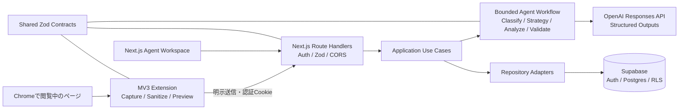

# AI Web Scout

Chromeで閲覧中のページを、AIエージェントがページ種別に応じて分析し、意思決定につながるインサイトとして保存・可視化するMVPです。

Chrome拡張は、ユーザーが確認したページ情報を送る「センサー兼入口」です。プロダクトの中心は、Next.jsのAgent Workspace、Supabaseによるユーザー単位の永続化、OpenAI Structured Outputsと制限付きTool Callingで構成したAIワークフローです。

## 解決する課題

求人、技術記事、GitHubリポジトリ、企業ページは、確認すべき観点がそれぞれ異なります。AI Web Scoutはページを5種別へ分類し、固定された分析方針から適切なものを選びます。結果だけでなく、安全な処理ステップ、根拠、リスク、推奨アクションも保存するため、「AIが何を処理して結論へ到達したか」をChain of Thoughtを公開せず確認できます。

## MVPの主な機能

- Manifest V3 Side Panelでタイトル、URL、可視本文、選択テキスト、meta description、取得日時を取得
- フォーム・編集領域・HTMLを除外し、送信前に内容をプレビュー
- 求人、技術記事、GitHub、企業・サービス、一般ページを分類・分析
- ページ種別固有の日本語分析結果と、種別・スコアに合った推奨ラベル
- ノード型Agent Workspaceで処理状態、ツール利用、所要時間、失敗箇所を可視化
- ダッシュボード、分析履歴、検索・フィルター、詳細、再分析
- ユーザープロフィールと希望条件による分析のパーソナライズ
- Supabase Auth、Postgres、RLSによるユーザー所有データの分離
- OpenAI Structured Outputs、Zod再検証、allowlist付きTool Calling

## System architecture



詳細は[アーキテクチャ設計](docs/architecture.md)と[AIエージェント設計](docs/phase-5-ai-agent.md)を参照してください。

## Agent workflow

1. 認証済みページ情報を共有Zodスキーマで検証
2. 本文を正規化し、入力上限までに制限
3. ページを`job / article / github / company / general`へ分類
4. 固定マップからページ種別別の分析方針を選択
5. 必要な場合だけ`load_user_profile`を1回実行
6. Structured Outputsで分析結果を生成
7. Zodで構造とページ種別の一致を再検証
8. 結果、タグ、安全な処理ステップをSupabaseへ保存

AIが自由にツールを選ぶ無限ループは使用しません。入力文字数、出力トークン、ツール回数、タイムアウトを環境変数で制限し、LLMの内部思考やChain of Thoughtは保存・表示しません。

## Technology

| 領域              | 技術                                                            |
| ----------------- | --------------------------------------------------------------- |
| Monorepo          | pnpm workspace、TypeScript                                      |
| Web               | Next.js App Router、React、Tailwind CSS、Motion、Lucide         |
| Form / Validation | React Hook Form、Zod                                            |
| Extension         | Chrome Manifest V3、Side Panel API、Vite、TypeScript            |
| Backend           | Next.js Route Handlers、Application Service、Repository Pattern |
| Data / Auth       | Supabase Auth、Postgres、RLS                                    |
| AI                | OpenAI Responses API、Structured Outputs、Tool Calling          |
| Quality           | Vitest、ESLint、Prettier、TypeScript                            |

拡張にはWXTやPlasmoを使用せず、権限・実行境界・生成物を追いやすいViteの最小構成を採用しています。

## Directory layout

```text
apps/
  web/
    app/                 App Router、画面、Route Handlers
    application/         AIユースケースとRepository interface
    domain/              ドメインモデル
    features/            画面機能と表示モデル
    infrastructure/      Supabase / OpenAI adapter
    services/            表示・AI composition service
  extension/
    src/capture/         DOM取得、秘匿化、入力制限
    src/sidepanel/       確認・送信UI
    src/launcher/        activeTab許可とSide Panel起動
packages/
  shared/                共通Zodスキーマ、型、上限値
  eslint-config/         共通Lint設定
supabase/
  migrations/            DB schema、index、RLS
docs/                     設計、セットアップ、各フェーズの判断
```

## Prerequisites

- Node.js 22以上
- Corepack 0.35以上
- pnpm 11以上（このリポジトリは`pnpm@11.9.0`を指定）
- Chrome
- Supabaseプロジェクト
- Structured Outputsを利用できるOpenAI APIキーとモデル

```powershell
node --version
corepack --version
corepack pnpm --version
```

## Local setup

### 1. インストール

```powershell
git clone https://github.com/gan-tech-hub/AIWebScout.git
cd AIWebScout
corepack pnpm install
Copy-Item .env.example .env.local
```

### 2. 環境変数

`.env.local`のプレースホルダーを実値へ変更します。

```dotenv
NEXT_PUBLIC_APP_URL=http://localhost:3000
NEXT_PUBLIC_SUPABASE_URL=https://YOUR_PROJECT_REF.supabase.co
NEXT_PUBLIC_SUPABASE_ANON_KEY=YOUR_PUBLISHABLE_OR_ANON_KEY

OPENAI_API_KEY=YOUR_OPENAI_API_KEY
OPENAI_MODEL=YOUR_STRUCTURED_OUTPUT_MODEL

AI_MAX_INPUT_CHARS=50000
AI_MAX_OUTPUT_TOKENS=3000
AI_MAX_TOOL_CALLS=1
AI_TIMEOUT_MS=45000

CHROME_EXTENSION_ORIGINS=chrome-extension://YOUR_EXTENSION_ID
```

`OPENAI_API_KEY`と`SUPABASE_SERVICE_ROLE_KEY`を`NEXT_PUBLIC_*`または`VITE_*`へ設定してはいけません。現在の通常動作にservice role keyは不要です。

### 3. Supabase

[Supabaseセットアップ手順](docs/supabase-setup.md)に従い、プロジェクトのリンク、migration、RLS、Auth URLを設定します。

```powershell
npx --yes supabase@2.109.1 login
npx --yes supabase@2.109.1 link --project-ref YOUR_PROJECT_REF
npx --yes supabase@2.109.1 db push --dry-run
npx --yes supabase@2.109.1 db push
npx --yes supabase@2.109.1 migration list
```

Supabase DashboardのAuthentication → URL Configuration:

- Site URL: `http://localhost:3000`
- Redirect URLs: `http://localhost:3000/**`

### 4. Webと拡張の起動

```powershell
corepack pnpm dev
```

- Web: `http://localhost:3000`
- Extension build output: `apps/extension/dist`

Chromeで`chrome://extensions`を開き、デベロッパーモードを有効化して「パッケージ化されていない拡張機能を読み込む」から`apps/extension/dist`を選択します。表示された拡張IDを`.env.local`の`CHROME_EXTENSION_ORIGINS`へ設定し、Web開発サーバーを再起動してください。

拡張のソース変更後は、拡張ビルド完了後に`chrome://extensions`の更新ボタンを押します。現在のManifest versionは`0.2.1`です。

## Basic usage

1. `http://localhost:3000/login`で登録・ログイン
2. Settingsでスキル、希望条件、AIへの追加指示を保存
3. 分析したいHTTP/HTTPSページをChromeで開く
4. ツールバーのAI Web Scoutを押し、「現在のページに接続」
5. Side Panelで「ページを取得」
6. 送信内容を確認して「AIで分析」
7. Agent Workspaceで進行状況とFinal Insightを確認

別オリジンへ移動すると`activeTab`権限が失効します。Side Panelの「Reconnect required」に従い、ツールバーから現在のページへ接続し直してください。

## Commands

```powershell
corepack pnpm dev
corepack pnpm typecheck
corepack pnpm lint
corepack pnpm test
corepack pnpm build
corepack pnpm format:check
```

フェーズ8完了時点で、共有契約・Chrome拡張・Webを合わせた109件のVitestが、API正常系・異常系、Repository所有者条件、AI構造化出力、文字数上限、空本文、秘匿化を検証します。

## Security and privacy

- `activeTab`、`scripting`、`sidePanel`とローカルWeb originだけを要求
- フォーム、textarea、select、contenteditable、script、style等を取得対象外にする
- HTMLを保存せず、プレーンテキストだけを最大50,000文字取得
- カード番号、パスワード、APIキー、認証トークンらしい文字列を送信前にマスク
- URLの機密クエリ値を`[REDACTED]`へ置換し、URL埋め込み認証情報を拒否
- 送信前のプレビューとユーザーの明示操作を必須化
- 全APIを認証し、Zod検証、CORS allowlist、ユーザーID条件、RLSで多層防御
- OpenAIキーとservice role keyをサーバー外へ出さない
- セッション更新Middleware、セキュリティヘッダーを適用
- AI失敗ログは分析ID、キャプチャID、安全なエラーコードだけを記録

本番公開前には、利用規約、プライバシーポリシー、保存期間、ユーザー自身によるデータ削除機能を追加してください。

## Troubleshooting

### `pnpm`が認識されない

```powershell
corepack pnpm install
corepack pnpm dev
```

必要に応じてCorepackを利用し、グローバルpnpmとのバージョン差を避けます。

### Next.jsで`__webpack_modules__[moduleId] is not a function`

開発サーバーを停止し、生成キャッシュ`apps/web/.next`だけを削除して再起動します。ソースやDBは削除しません。

```powershell
Remove-Item -LiteralPath .\apps\web\.next -Recurse -Force
corepack pnpm dev
```

### Chromeでページを取得できない

- `chrome://`、Chrome Web Store、拡張ページは取得不可
- 別サイトへ移動した場合はツールバーから「現在のページに接続」
- 拡張を更新した場合はSide Panelを閉じて開き直す
- `chrome://extensions`でManifest versionとエラーを確認

### 拡張から401またはCORSエラー

- Webアプリへログインする
- `.env.local`の`CHROME_EXTENSION_ORIGINS`と現在の拡張IDを一致させる
- Web開発サーバーを再起動する

### AI分析が失敗する

- Agent Workspaceの失敗ステップを確認
- `OPENAI_API_KEY`、`OPENAI_MODEL`、利用上限を確認
- 一時的な失敗では「再分析」を実行
- サーバーログの`AI_TIMEOUT / AI_PROVIDER_ERROR / INVALID_AI_OUTPUT`を確認

分析中に表示される複数の`GET /analyses/{id}`は、約1.5秒間隔の状態確認であり、AI処理の重複実行ではありません。

### Supabase migrationが`type already exists`で失敗する

既存schemaとRLSがmigrationに一致することを確認してから、[Supabase setupの履歴修復手順](docs/supabase-setup.md#troubleshooting-スキーマ適用済みで履歴だけ存在しない場合)を使用します。確認なしでschemaを削除しないでください。

## MVPで実装しない機能

- Webサイトの自動巡回、Playwright操作、自動応募、フォーム送信
- 複数サイトの自動スクレイピング
- Gmail API、GitHub API、外部検索API
- 自律的な無限ループ、マルチエージェント
- RAG、ベクトル検索
- 決済、チーム機能
- Chrome Web Store公開、Firefox、Safari

## Known limitations

- 非同期分析はNext.jsの`after()`を利用し、永続ジョブキューや自動再試行保証はない
- 分析中の更新は短いポーリングであり、Supabase Realtimeは未使用
- 履歴はMVP件数を想定し、ページネーションと集約クエリは未実装
- GitHub分析は表示中ページの本文・meta情報だけを使い、GitHub APIには接続しない
- AI出力は構造化・検証されるが、内容の正確性を保証するものではない
- Chromeの`activeTab`仕様により、別オリジン移動後はユーザーによる再接続が必要

## Roadmap

1. 永続ジョブキュー、指数バックオフ、自動再試行
2. Supabase Realtimeによる進行更新
3. データ保持期間、分析・キャプチャ削除、アカウント削除
4. ページネーション、集約クエリ、運用監視
5. GitHub APIなどページ種別別の任意ツール連携
6. ユーザー確認付き部分再実行と分析条件変更
7. デプロイ、利用規約、プライバシーポリシー、Chrome Web Store対応

## Documents

- [Architecture](docs/architecture.md)
- [Supabase setup](docs/supabase-setup.md)
- [Persistence and RLS](docs/persistence.md)
- [Chrome Extension](docs/phase-4-chrome-extension.md)
- [AI Agent](docs/phase-5-ai-agent.md)
- [End-to-end Integration](docs/phase-6-integration.md)
- [MVP Polish](docs/phase-7-polish.md)
- [Release Quality](docs/phase-8-release-quality.md)
