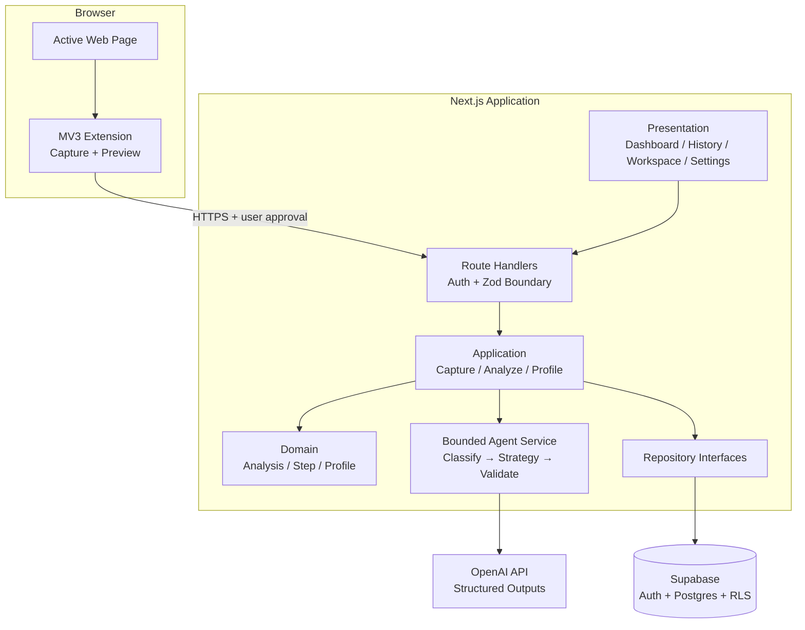
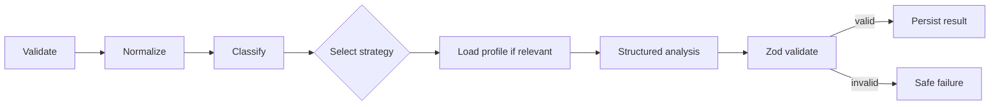

# AI Web Scout — MVP architecture and implementation plan

## 1. 要件の要約

AI Web Scout は、Chrome で閲覧中のページをユーザー確認のうえで取得し、ページ種別に適したAI分析を行い、その過程と成果を保存・可視化するサービスである。Chrome拡張はセンサー兼入口に限定し、中心は Next.js Webアプリ、Supabase、制御可能なAIワークフローで構成する。

AIの内部思考は扱わず、「入力検証」「分類完了」「リスク抽出」など監査可能な処理イベントのみを `agent_steps` として保存する。プライバシー、最小権限、構造化出力、上限付き処理を設計原則とする。

## 2. MVPスコープ

### 対象

- Manifest V3 Side Panel でページタイトル、URL、可視本文、選択テキスト、meta description、取得日時をプレビューして送信
- 求人、技術記事、GitHub、企業・サービス、一般ページの分類と種別別分析
- Supabase Auth、ユーザープロフィール、キャプチャ、分析、ステップ、タグの永続化
- ダッシュボード、履歴、設定、ノード型 Agent Workspace
- 構造化AI出力、Zod検証、エラー処理、再分析
- Vitest による契約、パース、API、Repository、キャプチャ整形のテスト

### 対象外

自動巡回、自動応募、外部検索、GitHub/Gmail API、RAG、ベクトル検索、マルチエージェント、決済、チーム、Web Store公開、Chrome以外のブラウザは実装しない。

## 3. システム構成



依存方向は Presentation → Application → Domain とし、Infrastructure は Domain/Application のインターフェースを実装する。Route Handler は認証、入力検証、ユースケース呼び出し、統一レスポンスへの変換だけを担う。

## 4. 採用技術と理由

| 技術                            | 採用理由                                                                 |
| ------------------------------- | ------------------------------------------------------------------------ |
| Next.js App Router / TypeScript | Server/Client境界とRoute Handlerを一つの型安全なアプリで管理できる       |
| Tailwind CSS / shadcn/ui        | デザイントークンを保ちながらアクセシブルなUIを短期間で構築できる         |
| Motion / Lucide                 | 状態遷移に意味を持たせ、依存を増やしすぎず高品質な体験を作れる           |
| React Hook Form / Zod           | フォームとAPI契約を同じ検証思想で扱える                                  |
| Supabase                        | Auth、Postgres、RLSを一体で提供しMVP速度と権限設計を両立できる           |
| OpenAI API                      | Structured Outputs と Tool Calling をサーバー側で制御できる              |
| Vite + Chrome APIs              | 拡張の構造と権限を透明に保ち、Side Panelを軽量に実装できる               |
| pnpm workspace                  | Web、拡張、共有契約を効率的かつ再現可能に管理できる                      |
| Vitest                          | Vite/TypeScriptとの親和性が高く、共有契約からAPIまで同じ基盤で試験できる |

WXT/Plasmo はMVPに必須でなく、生成規約や抽象化を増やすため採用しない。UIライブラリは統一感を優先し、React Bits等は必要性を検証して個別導入する。

## 5. ディレクトリ構成案

```text
apps/
  web/
    app/                 routes and route handlers
    components/          shared presentation
    features/            feature UI and view models
    domain/              domain models
    application/         use cases and repository ports
    infrastructure/      Supabase/OpenAI adapters
    features/            presentation and view models
    services/            application composition
    lib/                 framework and API utilities
  extension/
    src/background/      service worker
    src/capture/         capture and sanitization
    src/launcher/        activeTab grant and panel launch
    src/sidepanel/       review and submit UI
packages/
  shared/src/types/      transport/domain-neutral types
  shared/src/schemas/    Zod contracts
  shared/src/constants/  shared limits and enums
  eslint-config/         lint policy
supabase/migrations/     schema and RLS
docs/                    architecture and ADRs
```

## 6. DB設計案

全テーブルは UUID 主キー、UTC `timestamptz`、RLSを使用する。`user_id` は `auth.users(id)` を参照し、ユーザー所有行のみ `select/insert/update/delete` 可能にする。`agent_steps` と `analysis_tags` は親 `analyses` の所有権を `exists` で検証する。

| Table            | 主な列と判断                                                         |
| ---------------- | -------------------------------------------------------------------- |
| `profiles`       | user_id unique、skills/desired_conditions は jsonb、更新日時トリガー |
| `captured_pages` | プレーンテキストのみ、source_type、capture時刻、URL、文字数制約      |
| `analyses`       | page_type/status、共通検索列、詳細は result_json jsonb、captureへFK  |
| `agent_steps`    | 公開可能な工程ログ、status、duration、sort_order、analysisへFK       |
| `analysis_tags`  | analysis_id + normalized tag をunique化                              |

推奨indexは `(user_id, created_at desc)`、`analyses(user_id, status, page_type)`、`agent_steps(analysis_id, sort_order)`。ページ本文はMVPではDB保存するが、保持期間削減・削除機能をロードマップに含める。

## 7. API設計案

すべて認証必須、Zod検証、JSONの共通 envelope を使用する。

| Method | Path                      | Responsibility                      |
| ------ | ------------------------- | ----------------------------------- |
| POST   | `/api/captures/analyze`   | 拡張向けの保存＋分析開始            |
| GET    | `/api/analyses`           | 検索、種別/状態filter、sort付き履歴 |
| GET    | `/api/analyses/:id`       | page、analysis、steps、tagsを取得   |
| POST   | `/api/analyses/:id/retry` | 同じcaptureから再分析               |
| GET    | `/api/profile`            | 自分のプロフィール取得              |
| PUT    | `/api/profile`            | 自分のプロフィール更新              |

分析開始はMVPではレコードを即時 `pending` で返し、サーバー処理を開始する。Vercel等の実行制約が問題になる場合は後続で Supabase Edge Functions/queue へアダプター交換する。分析詳細はServer Componentの限定的なrefresh pollingを使用し、完了または失敗時に停止する。

## 8. AIエージェント処理フロー



1. 認証済み入力を共有Zod schemaで検証
2. 本文を空白正規化し上限まで切り詰め
3. 許可された5種へ分類
4. 固定マップから分析strategyを選択
5. 必要な場合だけプロフィールを読み込む
6. OpenAI Structured Outputsで分析
7. 共有schemaで再検証
8. 結果と公開可能なステップをtransactionalに保存

自由ループは用いない。`maxWorkflowSteps`、`maxToolCalls`、`maxInputChars`、`maxOutputTokens`、timeoutを設定し、Tool Callingはallowlist制とする。各stepは目的、入出力の短い概要、tool名、状態、時刻、duration、公開可能なエラーだけを記録し、prompt、hidden reasoning、chain-of-thoughtは保存しない。

## 9. 実装フェーズ

1. **Foundation**: monorepo、Web/Extension shell、共有契約、品質設定、README（本フェーズ）
2. **Persistence**: migration、RLS、型、Repositoryとテスト
3. **Product UI**: mockデータによるDashboard/History/Workspace/Settingsとテーマ
4. **Extension**: 安全なDOM取得、preview、認証API送信、詳細遷移
5. **AI workflow**: OpenAI、分類、strategy、構造化結果、step保存
6. **Integration**: polling、再分析、エラー/ローディング、結合確認
7. **Polish**: 日本語出力、推奨ラベル、ページ種別固有表示
8. **Release Quality**: テスト拡充、プライバシー、認証継続性、セットアップ、ロードマップ

各フェーズで `lint`、`typecheck`、`test`、`build` を実行し、外部サービス境界はmockまたはadapterで検証する。

## 10. 技術的リスク

| Risk                         | Mitigation                                                      |
| ---------------------------- | --------------------------------------------------------------- |
| 閲覧情報の過剰取得           | editable/form要素除外、plain text限定、上限、preview、明示送信  |
| 長文による費用・遅延         | 文字数・token・timeout上限、前処理、将来の段階要約              |
| 分類/構造化出力の不安定性    | enum制約、Structured Outputs、Zod再検証、安全なfailure          |
| Route Handlerの実行時間制限  | application portで分離し、queue/workerへ交換可能にする          |
| 拡張とWebの認証連携          | 短命token、許可origin、CORS、拡張ID設定を環境別管理             |
| RLS漏れ                      | user-scoped repository + RLSの二重防御、policy integration test |
| 動きの多いUIによる疲労       | motionを状態説明に限定、`prefers-reduced-motion`対応            |
| Node graphのアクセシビリティ | 同等情報のリスト/詳細panel、keyboard navigation、ARIA           |

## 11. 確認が必要な事項とMVP仮定

重大なブロッカーはないため次の仮定で進める。

- 認証は Supabase Email/Password を使用する（OAuthは後続追加可能）。
- 開発URLは `http://localhost:3000`、extension API接続先は設定可能にする。
- Side Panelを採用し、Launcher Popupから明示的に`activeTab`権限を取得する。
- 初期デプロイ先は未決定。Next.js互換環境を前提にadapter境界を維持する。
- 本文上限は共有定数 `50,000` 文字から開始し、実測で調整する。
- データ保持期間、削除ポリシー、利用規約は公開前に確定が必要。
- OpenAI model名、予算上限、Supabase project情報はフェーズ5/2開始時に環境変数で確定する。

## Agent Workspace UI方針

中央キャンバスに処理ノードと状態付きedge、左にcapture inspector、右に段階的に構築される Final Insight、選択ノードの詳細はdrawerで表示する。ノードはクリック/keyboard操作可能にし、runningのみ呼吸・粒子表現、completedは静的確定、failedは対象箇所へ明確な警告を出す。チャットは補足指示用の副次UIに限定する。
