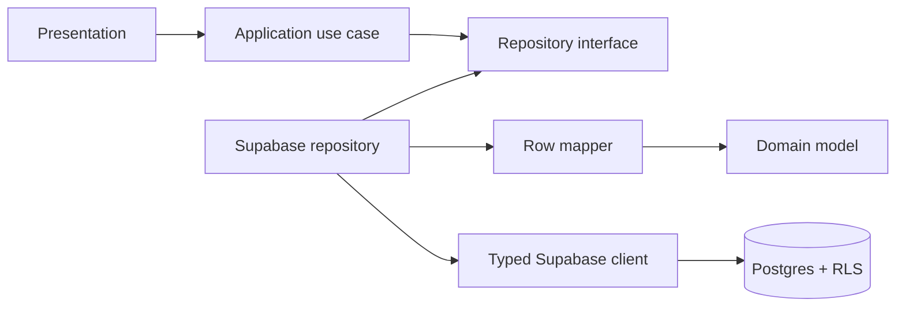

# Persistence architecture

## 目的

フェーズ2では、UI・Route Handler・AI処理からSupabaseの詳細を分離し、ユーザー所有データを安全に保存する基盤を構築する。

## レイヤーと依存方向



- Application層はRepository interfaceだけを参照する。
- Infrastructure層はSupabaseのsnake_case行をDomainのcamelCaseモデルへ変換する。
- UIとRoute HandlerはSupabase ClientやDB行を直接扱わない。
- RepositoryはRLSに加え、取得条件へ`user_id`を明示する。
- DB制約違反や通信失敗は`RepositoryError`へ変換し、上位層でAPIエラーへ変換できるようにする。

## テーブル

| Table            | 所有権       | 主な役割                                   |
| ---------------- | ------------ | ------------------------------------------ |
| `profiles`       | `user_id`    | 分析に利用するユーザープロフィール         |
| `captured_pages` | `user_id`    | ユーザー確認済みのプレーンテキスト取得情報 |
| `analyses`       | `user_id`    | 分析状態、共通結果、構造化JSON             |
| `agent_steps`    | 親`analyses` | 公開可能なAI処理イベント                   |
| `analysis_tags`  | 親`analyses` | 検索・分類用の正規化タグ                   |

## DB制約

- page type、analysis status、step status、source typeはPostgres enumで限定する。
- URLはHTTP/HTTPSのみとし、共有Zod schemaとDBの両方で検証する。
- 本文、選択テキスト、meta descriptionは共有定数と同じ最大文字数をDBでも制約する。
- JSON列は配列またはオブジェクトのトップレベル形状を制約する。
- recommendation score、稼働時間、処理時間は許容範囲を制約する。
- `updated_at`はDB triggerで更新し、クライアント時刻へ依存しない。
- 親削除時は子データをcascade deleteする。

## RLS

すべての公開テーブルでRLSを有効化し、`anon`にはテーブル権限を付与しない。`authenticated`だけに必要なCRUD権限を付与し、各policyで所有権を判定する。

直接`user_id`を持つテーブルは次の形式を使う。

```sql
using ((select auth.uid()) = user_id)
with check ((select auth.uid()) = user_id)
```

`agent_steps`と`analysis_tags`は、親`analyses.user_id`が`auth.uid()`と一致することを`exists`で確認する。`analyses`のinsert/updateでは、指定された`captured_page_id`も同じユーザーが所有することを確認する。

## 型の管理

`apps/web/infrastructure/supabase/database.types.ts`はmigrationと同時に管理する型スナップショットである。リモートDBへmigrationを適用した後は、Supabase DashboardまたはCLIから型を再生成し、差分がないことを確認する。

```powershell
npx --yes supabase@2.109.1 gen types typescript --project-id YOUR_PROJECT_REF --schema public
```

生成結果でファイルを置き換える場合は、Repositoryの型検査とテストを必ず実行する。

## service role key

MVPの通常処理はログインユーザーのセッションとRLSを利用する。`SUPABASE_SERVICE_ROLE_KEY`はRLSを迂回できるため、通常のRepositoryには渡さない。管理処理が必要になった場合だけ、server-onlyの限定されたadapterで利用する。
