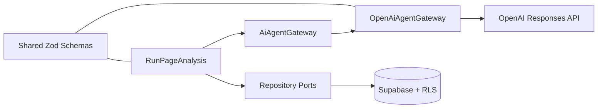

# Phase 5: Bounded AI Agent

## 目的

AI Web Scoutの中核として、単発プロンプトではなく、分類、方針選択、制限付きTool Calling、構造化検証、永続化を明示的に制御するAIワークフローを実装する。モデルへ処理全体の制御を委ねず、アプリケーションコードが実行順序、利用可能ツール、上限、停止条件を所有する。

## アーキテクチャ



- Application層はOpenAI SDKやSupabase Clientへ依存しない。
- `AiAgentGateway`がAIプロバイダー境界となる。
- `OpenAiAgentGateway`だけがOpenAI Responses APIを知る。
- `RunPageAnalysis`が工程、状態遷移、停止条件、永続化を管理する。
- `createAnalysisAgent`がInfrastructure実装を組み立てる。

## 制御フロー

```text
分析とユーザー所有権を検証
→ 入力データを検証
→ 本文を正規化・上限適用
→ Structured Outputsでページ分類
→ 固定マップから分析方針を選択
→ Structured Outputsで分析
→ 必要時のみプロフィールツールを実行
→ Zodで再検証
→ 分類との整合性を検証
→ 結果とタグを保存
```

ページ種別は `job | article | github | company | general` の5種に固定する。分析方針もアプリケーション側の固定マップから選び、モデルが任意の処理方針を追加できないようにする。

## Structured Outputs

分類結果と最終分析結果は共有ZodスキーマをOpenAIのJSON Schemaへ変換して取得し、受信後も同じZodスキーマで再検証する。

最終結果は共通項目とページ種別固有結果を持つ。

- 共通: 種別、タイトル、要約、重要点、リスク、推奨アクション、推奨度、信頼度、不足情報、タグ
- 求人: 業務、スキル、条件、適合度、キャリア価値、応募判断
- 技術記事: 前提知識、難易度、実務応用、学習優先度
- GitHub: 技術スタック、構成、機能、品質上の注目点、学習価値
- 企業・サービス: 提供価値、機能、顧客、ビジネスモデル、差別化
- 一般ページ: 目的、有用性、信頼性の注意点

分類結果と最終結果の`pageType`が一致しない場合は保存せず、分析を失敗させる。

## Tool Calling

MVPで許可するツールは `load_user_profile` のみとする。

- JSON Schemaがstrictな引数だけを受け付ける。
- ツール名はallowlistで照合する。
- 未登録ツールは即座に拒否する。
- `AI_MAX_TOOL_CALLS`で回数を制限する。既定値は1回。
- ツール結果送信後は`tool_choice: none`とし、再呼び出しを禁止する。
- 停止条件後に再度ツール要求が返った場合は失敗させる。
- プロフィールが未登録でも空結果として分析を継続する。

外部検索、ブラウザ操作、コード実行、書き込み系ツールはMVPで登録しない。

## Agent Step

保存するのはユーザーへ公開可能な操作ログであり、モデルの内部思考ではない。

| key                 | 表示名             |
| ------------------- | ------------------ |
| `validate_input`    | 入力データを検証   |
| `normalize_content` | 本文を整形         |
| `classify_page`     | ページ種別を判定   |
| `select_strategy`   | 分析方針を選択     |
| `load_profile`      | プロフィールを参照 |
| `analyze_page`      | 構造化分析を実行   |
| `validate_result`   | 分析結果を検証     |
| `save_result`       | 分析結果を保存     |

各ステップには状態、開始・終了時刻、所要時間、短い入出力概要、ツール名、公開可能なエラーだけを保存する。プロンプト全文、API応答全文、Chain of Thoughtは保存しない。

## 実行上限

| 環境変数               | 既定値 | 制約          |
| ---------------------- | -----: | ------------- |
| `AI_MAX_INPUT_CHARS`   |  50000 | 1,000〜50,000 |
| `AI_MAX_OUTPUT_TOKENS` |   3000 | 500〜10,000   |
| `AI_MAX_TOOL_CALLS`    |      1 | 0〜5          |
| `AI_TIMEOUT_MS`        |  45000 | 5〜120秒      |

`OPENAI_API_KEY`と`OPENAI_MODEL`はサーバー専用であり、`NEXT_PUBLIC_*`やChrome拡張へ含めない。モデル名は環境変数で差し替え、Application層へ固定しない。

## Prompt Injection対策

- ページ本文を信頼できない外部データとして明示する。
- 本文内の命令、システム指示、APIキー要求へ従わないよう指示する。
- ページ本文をdeveloper instructionへ連結せず、分析入力として分離する。
- 利用可能ツールをコード側で制限する。
- モデルの要求だけで外部アクションを追加しない。
- 確認できない内容は推測として区別し、不足情報へ記録する。

## エラー方針

- Timeout、OpenAI APIエラー、構造化出力不正、未知ツール、上限超過を区別する。
- ユーザー向けには安全な短いメッセージだけを保存する。
- Providerの内部レスポンスや秘密情報をDBへ保存しない。
- 失敗したステップと`analyses.status = failed`を記録する。
- 分類・分析・保存のいずれかが失敗した場合、completedとして扱わない。

## Phase 5の境界

フェーズ5は、保存済み`analysis`と`captured_page`を受けて実行できるAIユースケースを完成させる。Chrome拡張からの認証付きRoute Handler、分析開始API、ポーリング、実データによるAgent Workspace更新はフェーズ6で結合する。

既存DBスキーマで必要情報を保存できるため、フェーズ5で追加migrationは不要である。
